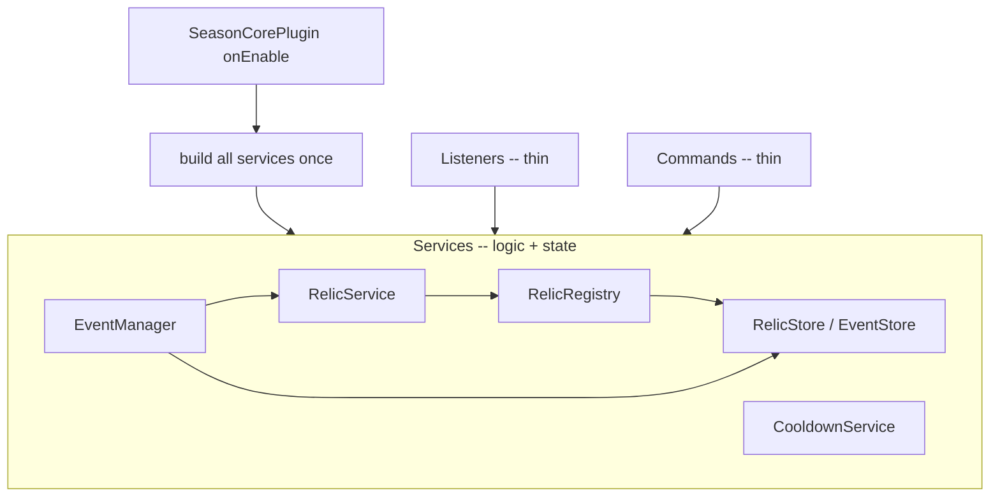

<!-- 332f68eb-144d-429b-b86c-379522ba63cc -->
---
todos:
  - id: "restructure"
    content: "Package-by-feature: move SeasonCommand+PlayerListener->season/, RelicListener->relic/, DataManager->announcement/; add event/ + util/; delete command/ listener/ storage/. Cross-file: fix package line in every moved file; update imports in SeasonCorePlugin + AnnouncementService; if renaming Season_core->SeasonCorePlugin also fix plugin.yml `main:` and all constructor param types that take the plugin (RelicManager, RelicStore, EventStore)."
    status: completed
  - id: "cooldown"
    content: "Add CooldownService (per-player, per-type). Delete RelicManager.remainingTime/remainingSeconds/tryUse + readyAtKey field. DONE - only tidy-up left: drop 4 unused imports in SeasonCommand."
    status: completed
  - id: "phasebow"
    content: "Fix PHASE_BOW: tag arrow in onBowFire, read tag on hit. Fix THE_WARD to require real shield block. Filter nearestLiving targets. DONE - optional hardening in Step 3g (BLOCKING modifier for THE_WARD; filter inside nearestLiving)."
    status: completed
  - id: "registry"
    content: "Build RelicRegistry + RelicStore + RelicService.mint enforcing uniqueness. Cross-file: RelicManager.create() only from RelicService.mint."
    status: completed
  - id: "destroy"
    content: "Add RelicDestroyListener (EntityDamageEvent on Item: LAVA/FIRE/EXPLOSION/VOID). Register in SeasonCorePlugin.onEnable."
    status: completed
  - id: "eventframework"
    content: "Build SeasonEvent, AbstractEvent, EventContext, ScoreTracker, EventManager. SeasonCorePlugin builds EventManager."
    status: completed
  - id: "bounty"
    content: "Implement BountyEvent. EventCommand.start maps bounty. REVISED: award is now a random relic drawn only from types not currently live (see random-prize / Step 10)."
    status: completed
  - id: "random-prize"
    content: "Step 10: Bounty (and future random-prize events) award a single relic chosen only from types not live in the world. Add RelicService.mintRandomAvailable(Player) returning the chosen RelicType (or null if all types live). Rewrite BountyEvent.stop to roll once via it (fixes prize() double-roll mismatch + silent no-award). BountyEvent.prize() returns null = random pool; delete RelicType.randomPrize()."
    status: pending
  - id: "commands"
    content: "Step 8 (do this now): edit plugin.yml (add event command + season.admin, gate relic+event); fix EventCommand usage strings /season event -> /event; add TabCompleter to RelicCommand + EventCommand; register tab completer in SeasonCorePlugin.setExecutor. Exact code in Step 8."
    status: pending
  - id: "catalog"
    content: "Step 9: repeatable recipe to add an event (create impl class + 2 EventCommand edits). Add EventContext plugin+everySecond helper + task-cancel for tick-based events. Worked KingOfTheHillEvent stub included."
    status: pending
isProject: false
---
# SMP Season: Architecture + Relic/Event System

## The goal
A running season where **relics** (unique custom items) are handed out by **server events**. A relic can be minted only once. It can be minted again only after the existing copy is destroyed in lava/fire/void. Admins start events with permission-gated commands. Bounty is the first event; more follow, each with its own mechanic so play never feels repetitive.

## What you already have (keep as-is)
These are good and mostly unchanged: `SeasonManager`/`SeasonConfigManager`/`SeasonSettings` (season timeline), `AnnouncementService` + `DataManager` (scheduled broadcasts), `PlayerListener` (join message + dimension locks), and the relic item model `RelicType`/`RelicTrigger`/`RelicTarget` plus item build/read in [RelicManager.java](src/main/java/me/zehnooo/season_core/relic/RelicManager.java).

---

## How to read this plan (important)
The 9 build steps are split into two sections:

- **SECTION A - COMPLETE** = verified present in the codebase. Kept in full for reference; no action needed. Step 3 has optional hardening (3g) with exact code if you want it.
- **SECTION B - OUTSTANDING** = the actual to-do list. Every edit is spelled out: which file, which line/method, and the exact code to paste.

Each step keeps the same three-part shape: **What changes -> Removed/renamed symbols -> Cross-file breaks table**. A step is only done when its table is clear.

### Master removal -> reference table (the "who calls this" cheat sheet)
| Removed / renamed | Introduced in | Referenced by (must fix) | Fix |
| --- | --- | --- | --- |
| `RelicManager.remainingSeconds` / `remainingTime` / `tryUse` / `readyAtKey` field | Step 2 | `RelicListener.consume`; `SeasonCommand.handleRelic` (check branch) | listener -> `CooldownService`; `SeasonCommand` -> delete relic subcommand |
| `SeasonCommand(SeasonManager, RelicManager)` -> `SeasonCommand(SeasonManager)` | Step 2 | `SeasonCorePlugin.onEnable` | change to `new SeasonCommand(seasons)` |
| `/season relic ...` subcommand | Step 2 | players / docs | replaced by top-level `/relic` (Step 8) |
| direct `RelicManager.create(type)` calls | Step 4 | `SeasonCommand.give` (deleted Step 2) | only `RelicService.mint` may call `create` |
| old `command/` `listener/` `storage/` packages | Step 1 | package line of every moved class + imports | update package lines + imports |
| `event` command executor set in `onEnable` | Step 8 | `plugin.yml` (must declare `event`) | declare command or `getCommand("event")` returns null -> NPE at boot |

---

## The mental model (read this first)
> **Listeners and Commands are thin. They translate a Bukkit event or a typed command into a single call on a Service. All logic and state live in Services.**



---

## Final folder layout
```
me.zehnooo.season_core
  SeasonCorePlugin.java              main class, thin bootstrap

  season/
    SeasonManager.java  SeasonConfigManager.java  SeasonSettings.java
    SeasonCommand.java               info output only
    PlayerListener.java              join message + dimension locks

  relic/
    RelicType.java  RelicTrigger.java  RelicTarget.java
    RelicManager.java                build/read item; owns arrow key
    CooldownService.java             per-player, per-type cooldowns
    RelicRegistry.java               tracks live relic UUIDs (uniqueness)
    RelicService.java                mint(type, player) -- only way to hand out a relic
    RelicStore.java                  persists live relic UUIDs (relics.yml)
    RelicListener.java               thin: routes use-events into services
    RelicDestroyListener.java        detects lava/fire/void -> frees the relic
    RelicCommand.java                /relic give|check|destroy

  event/
    SeasonEvent.java  AbstractEvent.java  EventContext.java  ScoreTracker.java
    EventManager.java  EventCommand.java  EventStore.java
    impl/ BountyEvent.java  (KingOfTheHillEvent, ...)

  announcement/  AnnouncementService.java  DataManager.java
  util/Msg.java
```

---

## Status at a glance
| Step | Title | Status |
| --- | --- | --- |
| 1 | Restructure + slim bootstrap | COMPLETE |
| 2 | CooldownService | COMPLETE - optional: drop 4 unused imports in `SeasonCommand` |
| 3 | RelicListener fixes | COMPLETE - optional hardening in 3g |
| 4 | Relic uniqueness | COMPLETE |
| 5 | Relic destruction detection | COMPLETE |
| 6 | Event framework | COMPLETE |
| 7 | BountyEvent | COMPLETE - award revised, see Step 10 |
| 8 | Commands + permissions | OUTSTANDING - do now (boot NPE) |
| 9 | Event catalog + shared infra | OUTSTANDING |
| 10 | Random available prize (Bounty award fix) | OUTSTANDING |

Do OUTSTANDING work in order: **Step 8 -> Step 10 -> Step 9.**

---
---

# SECTION A - COMPLETE (already in the codebase)

## Step 1 - Restructure + slim bootstrap  `[COMPLETE]`
**Verified:** feature folders exist; `command/`/`listener/`/`storage/` gone; `onEnable` is a flat wiring list calling `new SeasonCommand(seasons)`.

### Constructor reference (lock these names/signatures)
| Class | Constructor |
| --- | --- |
| `RelicManager` | `RelicManager(SeasonCorePlugin plugin)` |
| `CooldownService` | `CooldownService()` |
| `RelicStore` | `RelicStore(SeasonCorePlugin plugin)` |
| `RelicRegistry` | `RelicRegistry(RelicStore store)` |
| `RelicService` | `RelicService(RelicManager items, RelicRegistry registry)` |
| `RelicListener` | `RelicListener(RelicManager items, CooldownService cooldowns)` |
| `RelicDestroyListener` | `RelicDestroyListener(RelicManager relicManager, RelicRegistry registry)` |
| `RelicCommand` | `RelicCommand(RelicService relics, RelicManager items, RelicRegistry registry)` |
| `EventManager` | `EventManager(JavaPlugin plugin, RelicService relics)` |
| `EventCommand` | `EventCommand(EventManager events)` |
| `SeasonCommand` | `SeasonCommand(SeasonManager seasons)` |
| `PlayerListener` | `PlayerListener(SeasonManager seasons)` |
| `AnnouncementService` | `AnnouncementService(SeasonManager seasons, DataManager data)` |

Command model: `/season` = info only, `/relic` = relic admin, `/event` = events.

### Current bootstrap (for reference)
```java
setExecutor("season", new SeasonCommand(seasons));
setExecutor("relic",  new RelicCommand(relics, relicItems, registry));
setExecutor("event",  new EventCommand(events));
```

---

## Step 2 - CooldownService (cooldowns off the item)  `[COMPLETE]`
**Verified:** `CooldownService` created; `RelicManager` cooldown code removed; `SeasonCommand` is 1-arg with the `/relic` subcommand deleted; bootstrap calls `new SeasonCommand(seasons)`.

**Optional tidy-up (exact):** in [SeasonCommand.java](src/main/java/me/zehnooo/season_core/season/SeasonCommand.java) delete these 4 now-unused import lines:
```java
import me.zehnooo.season_core.relic.RelicManager;
import me.zehnooo.season_core.relic.RelicType;
import org.bukkit.entity.Player;
import org.bukkit.inventory.ItemStack;
```
Keep `Command`, `CommandExecutor`, `CommandSender`. Warning only - not a compile error.

### CooldownService (reference)
```java
public final class CooldownService {
    private final Map<UUID, Map<RelicType, Long>> readyAt = new HashMap<>();
    public boolean ready(Player p, RelicType t) {
        long until = readyAt.getOrDefault(p.getUniqueId(), Map.of()).getOrDefault(t, 0L);
        return System.currentTimeMillis() >= until;
    }
    public void trigger(Player p, RelicType t) {
        readyAt.computeIfAbsent(p.getUniqueId(), k -> new EnumMap<>(RelicType.class))
               .put(t, System.currentTimeMillis() + t.cooldown() * 50L);
    }
    public long remainingSeconds(Player p, RelicType t) {
        long until = readyAt.getOrDefault(p.getUniqueId(), Map.of()).getOrDefault(t, 0L);
        return Math.max(0, (until - System.currentTimeMillis() + 999) / 1000);
    }
}
```

---

## Step 3 - RelicListener fixes (make it thin + correct)  `[COMPLETE]`
**Verified against current [RelicListener.java](src/main/java/me/zehnooo/season_core/relic/RelicListener.java):** `onBowFire` tags the arrow (3d); `onPlayerAttack` reads the arrow tag, old `fromArrow` path gone (3e); THE_WARD guards `isBlocking() && damage<=0`, pets/stands filtered in `apply()` (3f). All PDC/`NamespacedKey` work is in `RelicManager` (3a).

Sub-parts 3a-3f are all `[DONE]`. The current implementations are correct and can stay as-is. The block below is only if you want to harden the two approximations.

### 3g. Optional hardening (exact how - only if you want it)
Both current implementations work; these make them more precise. Each is a self-contained edit.

**(A) THE_WARD - proc exactly when the shield absorbs damage.**
Problem with `event.getDamage() <= 0`: `getDamage()` is the *base* damage, not the post-block value, so on some server builds it is never <= 0 even when the shield blocked. The precise signal is the BLOCKING damage modifier, which is negative when a shield absorbs.

In [RelicListener.java](src/main/java/me/zehnooo/season_core/relic/RelicListener.java), replace the guard line in `onPlayerDamage`:
```java
// remove:
if (!(event.getDamage() <= 0)) return;
// add (requires import org.bukkit.event.entity.EntityDamageEvent;):
if (!event.isApplicable(EntityDamageEvent.DamageModifier.BLOCKING)) return;
if (event.getDamage(EntityDamageEvent.DamageModifier.BLOCKING) >= 0) return; // >=0 means nothing was blocked
```
If your API marks `DamageModifier` deprecated and you want to avoid it, the alternative is a second handler comparing raw vs final damage:
```java
@EventHandler
public void onPlayerDamage(EntityDamageByEntityEvent event) {
    if (!(event.getEntity() instanceof Player player)) return;
    if (!player.isBlocking()) return;
    if (event.getFinalDamage() >= event.getDamage()) return; // shield reduced nothing -> not a real block
    ItemStack item = findWard(player);
    if (item == null) return;
    apply(item, player, null);
}
```
Pick one; do not keep both plus the old line.

**(B) nearestLiving - skip pets/stands during selection (so a valid target is still chosen).**
Today the filter is in `apply()`, so if the closest entity is your pet the relic silently does nothing instead of picking the next entity. Move the filter into the loop in [RelicListener.java](src/main/java/me/zehnooo/season_core/relic/RelicListener.java):
```java
private LivingEntity nearestLiving(Player player, double range) {
    LivingEntity closest = null;
    double closestDist = range * range;
    for (Entity entity : player.getNearbyEntities(range, range, range)) {
        if (!(entity instanceof LivingEntity target) || target.equals(player)) continue;
        if (target instanceof ArmorStand) continue;
        if (target instanceof Tameable tameable && tameable.getOwner() != null) continue;
        double distance = player.getLocation().distanceSquared(target.getLocation());
        if (distance < closestDist) { closest = target; closestDist = distance; }
    }
    return closest;
}
```
After this, the two `apply()` guard lines (`instanceof Tameable` / `instanceof ArmorStand`) are redundant and can be deleted - but leaving them causes no harm.

---

## Step 4 - Relic uniqueness (RelicRegistry + RelicStore + RelicService)  `[COMPLETE]`
**Verified:** all three exist; `RelicCommand.give` routes through `RelicService.mint`. Rule going forward: **only `RelicService.mint` may call `RelicManager.create`.**

**Addition (Step 10):** `RelicService` also gains `mintRandomAvailable(Player)` for random-prize events. It picks only from types where `!registry.exists(type)`, then mints through `mint`, so uniqueness is still enforced in one place.

```java
public boolean mint(RelicType type, Player to) {
    if (registry.exists(type)) return false;   // uniqueness enforced here
    ItemStack relic = items.create(type);
    registry.register(type, items.getId(relic));
    to.getInventory().addItem(relic);
    return true;
}
```

---

## Step 5 - Relic destruction detection  `[COMPLETE]`
**Verified:** `RelicDestroyListener` exists and is registered. Frees the UUID on LAVA/FIRE/FIRE_TICK/BLOCK_EXPLOSION/ENTITY_EXPLOSION/VOID and broadcasts re-availability.

---

## Step 6 - Event framework  `[COMPLETE]`
**Verified:** `SeasonEvent`, `AbstractEvent`, `EventContext`, `ScoreTracker`, `EventManager` exist; `EventManager` built in `onEnable`. One active event at a time; auto-end task; `HandlerList.unregisterAll(active)` on stop. `EventContext` exposes `players()`, `relics()`, `playerOf(UUID)`, `broadcast(String)`.

---

## Step 7 - BountyEvent  `[COMPLETE - award revised in Step 10]`
**Verified:** `impl/BountyEvent.java` implemented; `EventCommand.start` maps `"bounty"`. Ring target assignment; `PlayerDeathEvent` scoring; winner award via the service.

**Revision:** the winner award is no longer a fixed `PHASE_BOW`. It is now a random relic chosen only from types not currently live in the world. This fixes two bugs in the current `stop()` (prize rolled twice -> mint/announce mismatch; random can hit an already-live type -> silent no-award) and is specified with exact edits in **Step 10**.

---
---

# SECTION B - OUTSTANDING (remaining work)
Every edit below is exact: file, location, and code to paste. **Step 8 first - the plugin currently NPEs at boot.**

---

## Step 8 - Commands + permissions  `[OUTSTANDING]`
Four concrete edits: 8.1 plugin.yml, 8.2 EventCommand text, 8.3 tab completers, 8.4 register the completers. Do them in this order, then reload.

### 8.1 - `plugin.yml`: declare `event`, add permission, gate `relic` + `event`
This is the boot fix. Replace the entire contents of [plugin.yml](src/main/resources/plugin.yml) with:
```yaml
name: season_core
version: '${version}'
main: me.zehnooo.season_core.SeasonCorePlugin
description: BangCraft SMP Plugin
api-version: '26.2'
load: POSTWORLD
commands:
  season:
    description: Season info and world status
    usage: /season
  relic:
    description: Relic admin commands
    usage: /relic <give|check|destroy>
    permission: season.admin
  event:
    description: Start/stop server events
    usage: /event <start|stop|list>
    permission: season.admin
permissions:
  season.admin:
    description: Access to relic and event admin commands
    default: op
```
Why this fixes the crash: `SeasonCorePlugin.onEnable` calls `setExecutor("event", ...)` which does `Objects.requireNonNull(getCommand("event"))`. `getCommand` returns null for any command not declared here, so `requireNonNull` throws and the plugin fails to enable. Declaring `event` makes `getCommand("event")` non-null. The `permission: season.admin` line makes Bukkit auto-reject non-ops with a no-permission message - no in-code check needed.

### 8.2 - `EventCommand`: fix the user-facing text from `/season event` to `/event`
In [EventCommand.java](src/main/java/me/zehnooo/season_core/event/EventCommand.java) change 3 strings:
- line 21: `"Usage: /season event <start|stop|list>"` -> `"Usage: /event <start|stop|list>"`
- line 33: `"Usage: /season event <start|stop|list>"` -> `"Usage: /event <start|stop|list>"`
- line 40: `"Usage: /season event start <id> <minutes>"` -> `"Usage: /event start <id> <minutes>"`

### 8.3 - Add tab completion to `RelicCommand` and `EventCommand`
Tab completion = the grey suggestions when you press Tab. A command class provides it by also implementing `TabCompleter` and overriding `onTabComplete` (return the list of suggestions for the current argument).

**RelicCommand** - in [RelicCommand.java](src/main/java/me/zehnooo/season_core/relic/RelicCommand.java):
1. Add imports at the top:
```java
import org.bukkit.command.TabCompleter;
import java.util.ArrayList;
import java.util.List;
```
2. Change the class declaration:
```java
public final class RelicCommand implements CommandExecutor, TabCompleter {
```
3. Add these two methods inside the class (e.g. just above `parseType`):
```java
@Override
public List<String> onTabComplete(CommandSender sender, Command command, String alias, String[] args) {
    if (args.length == 1) {
        return filter(List.of("give", "check", "destroy"), args[0]);
    }
    if (args.length == 2 && (args[0].equalsIgnoreCase("give") || args[0].equalsIgnoreCase("destroy"))) {
        List<String> types = new ArrayList<>();
        for (RelicType type : RelicType.values()) types.add(type.name().toLowerCase());
        return filter(types, args[1]);
    }
    return List.of();
}

private List<String> filter(List<String> options, String prefix) {
    String p = prefix.toLowerCase();
    List<String> out = new ArrayList<>();
    for (String option : options) if (option.startsWith(p)) out.add(option);
    return out;
}
```

**EventCommand** - in [EventCommand.java](src/main/java/me/zehnooo/season_core/event/EventCommand.java):
1. Add imports:
```java
import org.bukkit.command.TabCompleter;
import java.util.ArrayList;
import java.util.List;
```
2. Change the class declaration:
```java
public final class EventCommand implements CommandExecutor, TabCompleter {
```
3. Add these two methods inside the class:
```java
@Override
public List<String> onTabComplete(CommandSender sender, Command command, String alias, String[] args) {
    if (args.length == 1) {
        return filter(List.of("start", "stop", "list"), args[0]);
    }
    if (args.length == 2 && args[0].equalsIgnoreCase("start")) {
        return filter(List.of("bounty"), args[1]);   // add new event ids here (see Step 9)
    }
    return List.of();
}

private List<String> filter(List<String> options, String prefix) {
    String p = prefix.toLowerCase();
    List<String> out = new ArrayList<>();
    for (String option : options) if (option.startsWith(p)) out.add(option);
    return out;
}
```

### 8.4 - Register the tab completers in the bootstrap
`setExecutor` only sets the executor today; make it also register the completer when the class implements `TabCompleter`. In [SeasonCorePlugin.java](src/main/java/me/zehnooo/season_core/SeasonCorePlugin.java):
1. Add import:
```java
import org.bukkit.command.TabCompleter;
```
2. Replace the `setExecutor` helper (currently lines 67-69) with:
```java
private void setExecutor(String name, CommandExecutor executor) {
    var cmd = Objects.requireNonNull(getCommand(name));
    cmd.setExecutor(executor);
    if (executor instanceof TabCompleter tc) cmd.setTabCompleter(tc);
}
```
No other bootstrap lines change - the existing `setExecutor("relic", ...)` / `setExecutor("event", ...)` calls now wire completion automatically.

### 8.5 - Verify
Build, start the server (should enable with no NPE), then in-game:
- `/event ` + Tab -> suggests `start stop list`; `/event start ` + Tab -> suggests `bounty`.
- `/relic give ` + Tab -> suggests relic type names.
- A non-op running `/relic` or `/event` gets a no-permission message.

---

## Step 9 - Event catalog + shared infra  `[OUTSTANDING - not started]`
Goal: adding a new event is a fixed, small recipe. First the recipe, then the one-time infra needed for tick-based events, then a complete worked stub.

### 9.1 - The recipe to add ANY event (repeatable, exact)
1. Create `event/impl/<Name>Event.java` extending `AbstractEvent`; implement `id()`, `displayName()`, `prize()`, `start(EventContext)`, `stop(EventContext, boolean)`, plus any `@EventHandler` methods it needs.
2. In [EventCommand.java](src/main/java/me/zehnooo/season_core/event/EventCommand.java), add a case to the `start` switch (around line 52-55):
```java
case "<id>" -> new <Name>Event();
```
3. In the same file, add the id to the `list` output (line 32): `"Events: bounty, <id>"`.
4. In `EventCommand.onTabComplete` (added in Step 8.3), add the id to the `List.of("bounty")` list so it tab-completes.

That is the whole contract. `EventManager` handles registering the event as a listener, the auto-end timer, and unregistering on stop - you do not touch it per event.

### 9.2 - One-time infra for tick-based events (prerequisite for KOTH, Mob Arena, etc.)
Bounty is event-driven (reacts to deaths), so it needs no timer. "Hold the hill" / "survive waves" style events need a repeating task, but `AbstractEvent`/`EventContext` have no scheduler access today. Add it once:

**EventContext** - in [EventContext.java](src/main/java/me/zehnooo/season_core/event/EventContext.java):
```java
// add imports:
import org.bukkit.plugin.java.JavaPlugin;
import org.bukkit.scheduler.BukkitTask;

// add field + change constructor:
private final JavaPlugin plugin;
public EventContext(JavaPlugin plugin, RelicService relics) {
    this.plugin = plugin;
    this.relics = relics;
}

// add helper (runs r once per second; returns the task so the event can cancel it):
public BukkitTask everySecond(Runnable r) {
    return org.bukkit.Bukkit.getScheduler().runTaskTimer(plugin, r, 20L, 20L);
}
```
**EventManager** - in [EventManager.java](src/main/java/me/zehnooo/season_core/event/EventManager.java) the constructor builds the context; change:
```java
// from:
this.ctx = new EventContext(relics);
// to:
this.ctx = new EventContext(plugin, relics);
```
(`plugin` is already a field there.) Each tick-based event must cancel its own `BukkitTask` in `stop(...)`.

### 9.3 - Worked stub: KingOfTheHillEvent (copy-paste, compiles)
Create [event/impl/KingOfTheHillEvent.java](src/main/java/me/zehnooo/season_core/event/impl/KingOfTheHillEvent.java):
```java
package me.zehnooo.season_core.event.impl;

import me.zehnooo.season_core.event.AbstractEvent;
import me.zehnooo.season_core.event.EventContext;
import me.zehnooo.season_core.relic.RelicType;
import org.bukkit.entity.Player;
import org.bukkit.scheduler.BukkitTask;

public final class KingOfTheHillEvent extends AbstractEvent {

    private BukkitTask task;   // the per-second scorer; cancelled in stop()

    @Override public String id() { return "koth"; }
    @Override public String displayName() { return "King of the Hill"; }
    @Override public RelicType prize() { return RelicType.THE_WARD; }

    @Override
    public void start(EventContext ctx) {
        scores.reset();
        ctx.broadcast(displayName() + " started! Hold the hill to score.");
        // Award 1 point per second to each player standing in the hill region.
        task = ctx.everySecond(() -> {
            for (Player p : ctx.players()) {
                if (inHill(p)) scores.add(p.getUniqueId(), 1);
            }
        });
    }

    @Override
    public void stop(EventContext ctx, boolean awardPrize) {
        if (task != null) { task.cancel(); task = null; }
        Player winner = ctx.playerOf(scores.leader());
        if (awardPrize && winner != null && ctx.relics().mint(prize(), winner)) {
            ctx.broadcast(winner.getName() + " won " + prize().displayName() + "!");
        }
    }

    private boolean inHill(Player p) {
        // TODO: define the real region. Placeholder so it compiles/runs:
        // e.g. return p.getWorld().getName().equals("world")
        //        && p.getLocation().distance(new Location(p.getWorld(), 0, 64, 0)) <= 8;
        return false;
    }
}
```
Then apply the recipe (9.1) for id `koth`:
- `EventCommand.start` switch: add `case "koth" -> new KingOfTheHillEvent();`
- `list` string: `"Events: bounty, koth"`
- `onTabComplete` start list: `List.of("bounty", "koth")`

### 9.4 - Relic -> event mapping (build these as separate stubs over time)
- **PHASE_BOW - Bounty Hunt** (done, Step 7)
- **THE_WARD - King of the Hill** (worked stub above)
- **EMBER_BLADE - Boss Rush** - spawn a tanky mob; track damage dealt.
- **WIND_SPEAR - Sprint Trials** - checkpoint/parkour chain; first through wins.
- **AXECALIBUR - Duel Bracket** - 1v1 single-elimination.
- **HORN_OF_HEALTH - Mob Arena** - wave survival.
- **SLOWNESS_SHARD - Manhunt/Juggernaut** - longest beacon hold.
- **CLOAK - Hide & Seek** - seekers vs hiders on a timer.

Each is one `impl/*.java` + the 3 recipe edits. Shared helpers to add as you need them: region-definition helper (replace the `inHill` TODO), opt-in join, countdown boss bar. Fixed-prize events award via `ctx.relics().mint(prize(), winner)`; random-prize events (like Bounty) use `ctx.relics().mintRandomAvailable(winner)` (Step 10).

---
---

# SECTION B (cont.)

## Step 10 - Random available prize (Bounty award fix)  `[OUTSTANDING]`
**Why:** `BountyEvent` now awards a random relic, but the current `stop()` has two bugs: (1) it calls `prize()` twice, so it mints one random relic and announces a different one; (2) `RelicType.randomPrize()` can pick a type that already exists, so `mint` returns false and the winner silently gets nothing. Goal: draw the prize only from types NOT currently live, and roll exactly once, so "no prize" is impossible unless every type is already claimed.

### 10.1 - RelicService: add `mintRandomAvailable`
The pool is every `RelicType` whose copy is not live. `RelicRegistry.exists(type)` already reports liveness, so no registry change is needed. In [RelicService.java](src/main/java/me/zehnooo/season_core/relic/RelicService.java):
1. Add imports:
```java
import java.util.ArrayList;
import java.util.List;
import java.util.concurrent.ThreadLocalRandom;
```
2. Add this method:
```java
public RelicType mintRandomAvailable(Player to) {
    List<RelicType> pool = new ArrayList<>();
    for (RelicType type : RelicType.values()) {
        if (!registry.exists(type)) pool.add(type);   // exclude relics already live in the world
    }
    if (pool.isEmpty()) return null;                  // every type is claimed
    RelicType chosen = pool.get(ThreadLocalRandom.current().nextInt(pool.size()));
    return mint(chosen, to) ? chosen : null;          // mint re-checks uniqueness; chosen is available
}
```

### 10.2 - BountyEvent: roll once via the service
In [BountyEvent.java](src/main/java/me/zehnooo/season_core/event/impl/BountyEvent.java) replace the whole `stop` method with:
```java
@Override
public void stop(EventContext ctx, boolean awardPrize) {
    Player winner = ctx.playerOf(scores.leader());
    if (!awardPrize || winner == null) return;
    RelicType won = ctx.relics().mintRandomAvailable(winner);
    if (won != null) {
        ctx.broadcast(winner.getName() + " won " + won.displayName() + "!");
    } else {
        ctx.broadcast("Every relic is already claimed - no prize to award.");
    }
}
```
One call to the picker, so the minted relic and the announced relic are always the same, and an already-live type can never be chosen.

### 10.3 - Retire the availability-blind picker
- In [BountyEvent.java](src/main/java/me/zehnooo/season_core/event/impl/BountyEvent.java), change `prize()` to signal "random from pool":
```java
@Override
public RelicType prize() { return null; }   // null = award a random available relic (see stop())
```
- In [RelicType.java](src/main/java/me/zehnooo/season_core/relic/RelicType.java) delete the now-unused `randomPrize()` (lines 39-41). It ignores liveness and would reintroduce the no-award bug if reused.
- Keep `SeasonEvent.prize()` in the interface: FIXED-prize events (Step 9 catalog, e.g. KOTH -> THE_WARD) still return a real type and award via `ctx.relics().mint(prize(), winner)`. Convention: **non-null `prize()` = fixed relic; null `prize()` = random available relic.**

### 10.4 - Edge case
If all 8 types are live at once, `mintRandomAvailable` returns null and Bounty broadcasts the "already claimed" message instead of awarding. That is the only way "no prize" can happen, and it is unavoidable - nothing is free to give.

### 10.5 - Verify
- Clear a couple types (`/relic destroy <type>`), run a bounty round to completion (let the timer end so `award=true`): the winner receives one of the available types and the broadcast names that same relic.
- Give out every type first, then finish a round: no relic is handed out and the "already claimed" message shows.
